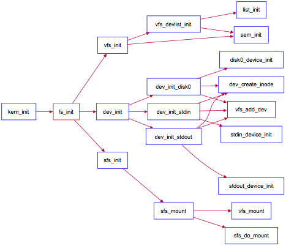

# 实验八：文件系统

## 实验目的
通过完成本次实验，希望能达到以下目标：
- 了解基本的文件系统系统调用的实现方法；
- 了解一个基于索引节点组织方式的Simple FS文件系统的设计与实现；
- 了解文件系统抽象层-VFS的设计与实现；

## 实验内容
本次实验涉及的是文件系统，通过分析了解ucore文件系统的总体架构设计，完善读写文件操作，从新实现基于文件系统的执行程序机制（即改写do_execve），从而可以完成执行存储在磁盘上的文件和实现文件读写等功能。

## 文件系统设计与实现
### ucore 文件系统总体介绍
UNIX提出了四个文件系统抽象概念：文件(file)、目录项(dentry)、索引节点(inode)和安装点(mount point)
- 文件：文件中的内容可理解为是一有序字节，文件有一个方便应用程序识别的文件名称（也称文件路径名）。典型的文件操作有读、写、创建和删除等。
- 目录项：目录项不是目录（又称文件路径），而是**目录的组成部分**。在UNIX中目录被看作一种特定的文件，而目录项是文件路径中的一部分。如一个文件路径名是“/test/testfile”，则包含的目录项为：
    - 根目录“/”，
    - 目录“test”和文件“testfile”
    - 这三个都是目录项。
    - 一般而言，目录项包含目录项的名字（文件名或目录名）和目录项的索引节点位置。
- 索引节点：UNIX将文件的相关元数据信息（如访问控制权限、大小、拥有者、创建时间、数据内容等等信息）存储在一个单独的数据结构中，该结构被称为索引节点。
- 安装点：在UNIX中，文件系统被安装在一个特定的文件路径位置，这个位置就是安装点。所有的已安装文件系统都作为**根文件系统树中的叶子**出现在系统中。

ucore模仿了UNIX的文件系统设计，ucore的文件系统架构主要由四部分组成：
- **通用文件系统访问接口层**：该层提供了一个从用户空间到文件系统的标准访问接口。这一层访问接口让应用程序能够通过一个简单的接口获得ucore内核的文件系统服务。
- **文件系统抽象层**：向上提供一个一致的接口给内核其他部分（文件系统相关的系统调用实现模块和其他内核功能模块）访问。向下提供一个同样的抽象函数指针列表和数据结构屏蔽不同文件系统的实现细节。
- **Simple FS文件系统层**：一个基于索引方式的简单文件系统实例。向上通过各种具体函数实现以对应文件系统抽象层提出的抽象函数。向下访问外设接口
- **外设接口层**：向上提供device访问接口屏蔽不同硬件细节。向下实现访问各种具体设备驱动的接口，比如disk设备接口/串口设备接口/键盘设备接口等。

假如应用程序操作文件（打开/创建/删除/读写）：
1. 通过文件系统的通用文件系统访问接口层为用户空间提供的访问接口进入文件系统内部；
2. 文件系统抽象层把访问请求转发给某一具体文件系统（比如SFS文件系统）；
3. 具体文件系统（Simple FS文件系统层）把应用程序的访问请求转化为对磁盘上的block的处理请求，并通过外设接口层交给磁盘驱动例程来完成具体的磁盘操作。

- 通用文件系统访问接口
    - 文件系统相关用户库
        - write::usr/libs/file.c
    - 用户态文件系统相关系统调用访问接口
        - sys_write/sys_call::/usr/libs/syscall.c
    - 内核态文件系统相关系统调用实现
        - sys_write::/kern/syscall/syscall.c
- 文件系统抽象层VFS
    - dir接口
    - file接口
    - inode接口
    - etc...
    - sysfile_write::kern/fs/sysfile.c 
    - file_write::/kern/fs/file.c 
    - vop_write::/kern/fs/vfs/inode.h
- Simple FS文件系统实现
    - sfs的inode实现
    - sfs的外设访问接口
    - sfs_write::kern/fs/sfs/sfs_inode.c
    - sfs_wbuf::/kern/fs/sfs/sfs_io.c
- 文件系统IO设备接口
    - device访问接口
    - stdin/stdout访问接口
    - etc...
    - dop_io::/kern/fs/devs/dev.h
    - disk0_io::/kern/fs/devs/dev_disk0.c
- 硬盘驱动、串口驱动
    - ide_write_secs::/kern/driver/ide.c

#### ucore文件系统总体结构
从ucore操作系统不同的角度来看，ucore中的文件系统架构包含四类主要的数据结构, 它们分别是：
- 超级块（SuperBlock），它主要从**文件系统的全局角度**描述特定文件系统的全局信息。它的作用范围是整个OS空间。
- 索引节点（inode）：它主要从**文件系统的单个文件的角度**描述了文件的各种属性和数据所在位置。它的作用范围是整个OS空间。
- 目录项（dentry）：它主要从**文件系统的文件路径的角度**描述了文件路径中的一个特定的目录项（注：一系列目录项形成目录/文件路径）。它的作用范围是整个OS空间。
    - 对于SFS而言，inode(具体为struct sfs_disk_inode)对应于物理磁盘上的具体对象，
    - dentry（具体为struct sfs_disk_entry）是一个内存实体，其中的ino成员指向对应的inode number，另外一个成员是file name(文件名).
- 文件（file），它主要从进程的角度描述了一个进程在访问文件时需要了解的文件标识，文件读写的位置，文件引用情况等信息。它的作用范围是某一具体进程。


### 通用文件系统访问接口
#### 文件和目录相关用户库函数
在文件操作方面，最基本的相关函数是open、close、read、write。
- 在读写一个文件之前，首先要用open系统调用将其打开。
    - open的第一个参数指定文件的路径名，可使用绝对路径名；
    - 第二个参数指定打开的方式，可设置为O_RDONLY、O_WRONLY、O_RDWR，分别表示只读、只写、可读可写。
    - 在打开一个文件后，就可以使用它返回的文件描述符fd对文件进行相关操作。
- 在使用完一个文件后，还要用close系统调用把它关闭，其参数就是文件描述符fd。这样它的文件描述符就可以空出来，给别的文件使用。
- 读写文件内容的系统调用是read和write。read系统调用有三个参数：
    - 一个指定所操作的文件描述符，一个指定读取数据的存放地址，最后一个指定读多少个字节。在C程序中调用该系统调用的方法如下：`count = read(filehandle, buffer, nbytes);`。
    - 该系统调用会把实际读到的字节数返回给count变量。在正常情形下这个值与nbytes相等，但有时可能会小一些。例如，在读文件时碰上了文件结束符，从而提前结束此次读操作。

对于目录而言，最常用的操作是跳转到某个目录，这里对应的用户库函数是`chdir`。然后就需要读目录的内容了，即列出目录中的文件或目录名，这在处理上与读文件类似，即需要：通过opendir函数打开目录，通过readdir来获取目录中的文件信息，读完后还需通过closedir函数来关闭目录。由于在ucore中把目录看成是一个特殊的文件，所以opendir和closedir实际上就是调用与文件相关的open和close函数。只有readdir需要调用获取目录内容的特殊系统调用sys_getdirentry。而且这里没有写目录这一操作。在目录中增加内容其实就是在此目录中创建文件，需要用到创建文件的函数。

#### 文件和目录访问相关系统调用
与文件相关的open、close、read、write用户库函数对应的是sys_open、sys_close、sys_read、sys_write四个系统调用接口。与目录相关的readdir用户库函数对应的是sys_getdirentry系统调用。这些系统调用函数接口将通过syscall函数来获得ucore的内核服务。当到了ucore内核后，在调用文件系统抽象层的file接口和dir接口。

### 文件系统抽象层 - VFS
文件系统抽象层是把不同文件系统的对外共性接口提取出来，形成一个**函数指针数组**，这样，通用文件系统访问接口层只需访问文件系统抽象层，而不需关心具体文件系统的实现细节和接口。

#### file & dir接口
file&dir接口层定义了进程在内核中直接访问的文件相关信息，这定义在file数据结构中，具体描述如下：
```
struct file {
    enum {
        FD_NONE, FD_INIT, FD_OPENED, FD_CLOSED,
    } status;                   //访问文件的执行状态
    bool readable;              //文件是否可读
    bool writable;              //文件是否可写
    int fd;                     //文件在filemap中的索引值
    off_t pos;                  //访问文件的当前位置
    struct inode *node;         //该文件对应的内存inode指针
    int open_count;             //打开此文件的次数
};
```
而在kern/process/proc.h中的proc_struct结构中描述了进程访问文件的数据接口files_struct，其数据结构定义如下：
```
struct files_struct {
    struct inode *pwd;           //进程当前执行目录的内存inode指针
    struct file *fd_array;       //进程打开文件的数组
    atomic_t files_count;        //访问此文件的线程个数
    semaphore_t files_sem;       //确保对进程控制块中fs_struct的互斥访问
};
```

当创建一个进程后，该进程的files_struct将会被初始化或复制父进程的files_struct。当用户进程打开一个文件时，将从fd_array数组中取得一个空闲file项，然后会把此file的成员变量node指针指向一个代表此文件的inode的起始地址。

#### inode 接口
index node是位于内存的索引节点，它是VFS结构中的重要数据结构，因为它实际负责把不同文件系统的特定索引节点信息（甚至不能算是一个索引节点）统一封装起来，避免了进程直接访问具体文件系统。其定义如下：
```
struct inode {
    union {                                   //包含不同文件系统特定inode信息的union成员变量
        struct device __device_info;          //设备文件系统内存inode信息
        struct sfs_inode __sfs_inode_info;    //SFS文件系统内存inode信息
    } in_info;   
    enum {
        inode_type_device_info = 0x1234,
        inode_type_sfs_inode_info,
    } in_type;                          //此inode所属文件系统类型
    atomic_t ref_count;                 //此inode的引用计数
    atomic_t open_count;                //打开此inode对应文件的个数
    struct fs *in_fs;                   //抽象的文件系统，包含访问文件系统的函数指针
    const struct inode_ops *in_ops;     //抽象的inode操作，包含访问inode的函数指针     
};
```
在inode中，有一成员变量为in_ops，这是对此inode的操作函数指针列表，其数据结构定义如下：
```
struct inode_ops {
    unsigned long vop_magic;
    int (*vop_open)(struct inode *node, uint32_t open_flags);
    int (*vop_close)(struct inode *node);
    int (*vop_read)(struct inode *node, struct iobuf *iob);
    int (*vop_write)(struct inode *node, struct iobuf *iob);
    int (*vop_getdirentry)(struct inode *node, struct iobuf *iob);
    int (*vop_create)(struct inode *node, const char *name, bool excl, struct inode **node_store);
    int (*vop_lookup)(struct inode *node, char *path, struct inode **node_store);
……
 };
```
参照上面对SFS中的索引节点操作函数的说明，可以看出inode_ops是**对常规文件、目录、设备文件所有操作的一个抽象函数表示**。对于某一具体的文件系统中的文件或目录，只需实现相关的函数，就可以被用户进程访问具体的文件了，且用户进程无需了解具体文件系统的实现细节。

### Simple FS 文件系统
ucore内核把所有文件都看作是字节流，任何内部逻辑结构都是专用的，由应用程序负责解释。但是ucore区分文件的物理结构。ucore目前支持如下几种类型的文件：
- 常规文件：文件中包括的内容信息是由应用程序输入。SFS文件系统在普通文件上不强加任何内部结构，把其文件内容信息看作为字节。
- 目录：包含一系列的entry，每个entry包含文件名和指向与之相关联的索引节点（index node）的指针。目录是按层次结构组织的。
- 链接文件：实际上一个链接文件是一个已经存在的文件的另一个可选择的文件名。
- 设备文件：不包含数据，但是提供了一个映射物理设备（如串口、键盘等）到一个文件名的机制。可通过设备文件访问外围设备。
- 管道：管道是进程间通讯的一个基础设施。管道缓存了其输入端所接受的数据，以便在管道输出端读的进程能一个先进先出的方式来接受数据。

SFS文件系统中目录和常规文件具有共同的属性，而这些属性保存在索引节点中。SFS通过索引节点来管理目录和常规文件，索引节点包含操作系统所需要的关于某个文件的关键信息，比如文件的属性、访问许可权以及其它控制信息都保存在索引节点中。可以有多个文件名可指向一个索引节点。

#### 文件系统的布局
文件系统通常保存在磁盘上。在本实验中，第三个磁盘（即disk0，前两个磁盘分别是`ucore.img`和`swap.img`）用于存放一个SFS文件系统（Simple Filesystem）。通常文件系统中，磁盘的使用是以扇区（Sector）为单位的，但是为了实现简便，SFS 中以 block （4K，与内存 page 大小相等）为基本单位。
SFS文件系统的布局如下图所示。
` superblock -> root-dir inode -> freemap -> inode/file_data/dir_data_blocks`

第0个块（4K）是超级块（superblock），它包含了关于文件系统的所有关键参数，当计算机被启动或文件系统被首次接触时，超级块的内容就会被装入内存。其定义如下：
```
struct sfs_super {
    uint32_t magic;                                  /* magic number, should be SFS_MAGIC */
    uint32_t blocks;                                 /* # of blocks in fs */
    uint32_t unused_blocks;                         /* # of unused blocks in fs */
    char info[SFS_MAX_INFO_LEN + 1];                /* infomation for sfs  */
};
```
可以看到，包含：
- 成员变量魔数magic，其值为`0x2f8dbe2a`，内核通过它来检查磁盘镜像是否是合法的 SFS img；
- 成员变量blocks记录了SFS中所有block的数量，即 img 的大小；
- 成员变量unused_block记录了SFS中还没有被使用的block的数量；
- 成员变量info包含了字符串"simple file system"。

第1个块放了一个root-dir的inode，用来记录根目录的相关信息。有关inode还将在后续部分介绍。通过这个root-dir的inode信息就可以定位并查找到根目录下的所有文件信息。

从第2个块开始，根据SFS中所有块的数量，用1个bit来表示一个块的占用和未被占用的情况。这个区域称为SFS的freemap区域，这将占用若干个块空间。为了更好地记录和管理freemap区域，专门提供了两个文件kern/fs/sfs/bitmap.[ch]来完成根据一个块号查找或设置对应的bit位的值。
```
struct bitmap {
    uint32_t nbits;
    uint32_t nwords;
    WORD_TYPE *map;
};
```
最后在剩余的磁盘空间中，存放了所有其他目录和文件的inode信息和内容数据信息。需要注意的是虽然inode的大小小于一个块的大小（4096B），但为了实现简单，每个 inode 都占用一个完整的 block。
在sfs_fs.c文件中的sfs_do_mount函数中，完成了加载位于硬盘上的SFS文件系统的超级块superblock和freemap的工作。这样，在内存中就有了SFS文件系统的全局信息。
```
/*
 * sfs_do_mount - mount sfs file system.
 *
 * @dev:        the block device contains sfs file system
 * @fs_store:   the fs struct in memroy
 */
static int
sfs_do_mount(struct device *dev, struct fs **fs_store) {
    static_assert(SFS_BLKSIZE >= sizeof(struct sfs_super));
    static_assert(SFS_BLKSIZE >= sizeof(struct sfs_disk_inode));
    static_assert(SFS_BLKSIZE >= sizeof(struct sfs_disk_entry));

    if (dev->d_blocksize != SFS_BLKSIZE) {
        return -E_NA_DEV;
    }

    /* allocate fs structure */
    struct fs *fs;
    if ((fs = alloc_fs(sfs)) == NULL) {
        return -E_NO_MEM;
    }
    struct sfs_fs *sfs = fsop_info(fs, sfs);
    sfs->dev = dev;

    int ret = -E_NO_MEM;
    void *sfs_buffer;
    if ((sfs->sfs_buffer = sfs_buffer = kmalloc(SFS_BLKSIZE)) == NULL) {
        goto failed_cleanup_fs;
    }

    /* load and check superblock */
    if ((ret = sfs_init_read(dev, SFS_BLKN_SUPER, sfs_buffer)) != 0) {
        goto failed_cleanup_sfs_buffer;
    }

    ret = -E_INVAL;

    struct sfs_super *super = sfs_buffer;
    if (super->magic != SFS_MAGIC) {
        cprintf("sfs: wrong magic in superblock. (%08x should be %08x).\n",
                super->magic, SFS_MAGIC);
        goto failed_cleanup_sfs_buffer;
    }
    if (super->blocks > dev->d_blocks) {
        cprintf("sfs: fs has %u blocks, device has %u blocks.\n",
                super->blocks, dev->d_blocks);
        goto failed_cleanup_sfs_buffer;
    }
    super->info[SFS_MAX_INFO_LEN] = '\0';
    sfs->super = *super;

    ret = -E_NO_MEM;
    uint32_t i;

    /* alloc and initialize hash list */
    list_entry_t *hash_list;
    if ((sfs->hash_list = hash_list = kmalloc(sizeof(list_entry_t) * SFS_HLIST_SIZE)) == NULL) {
        goto failed_cleanup_sfs_buffer;
    }
    for (i = 0; i < SFS_HLIST_SIZE; i ++) {
        list_init(hash_list + i);
    }

    /* load and check freemap */
    struct bitmap *freemap;
    uint32_t freemap_size_nbits = sfs_freemap_bits(super);
    if ((sfs->freemap = freemap = bitmap_create(freemap_size_nbits)) == NULL) {
        goto failed_cleanup_hash_list;
    }
    uint32_t freemap_size_nblks = sfs_freemap_blocks(super);
    if ((ret = sfs_init_freemap(dev, freemap, SFS_BLKN_FREEMAP, freemap_size_nblks, sfs_buffer)) != 0) {
        goto failed_cleanup_freemap;
    }

    uint32_t blocks = sfs->super.blocks, unused_blocks = 0;
    for (i = 0; i < freemap_size_nbits; i ++) {
        if (bitmap_test(freemap, i)) {
            unused_blocks ++;
        }
    }
    assert(unused_blocks == sfs->super.unused_blocks);

    /* and other fields */
    sfs->super_dirty = 0;
    sem_init(&(sfs->fs_sem), 1);
    sem_init(&(sfs->io_sem), 1);
    sem_init(&(sfs->mutex_sem), 1);
    list_init(&(sfs->inode_list));
    cprintf("sfs: mount: '%s' (%d/%d/%d)\n", sfs->super.info,
            blocks - unused_blocks, unused_blocks, blocks);

    /* link addr of sync/get_root/unmount/cleanup funciton  fs's function pointers*/
    fs->fs_sync = sfs_sync;
    fs->fs_get_root = sfs_get_root;
    fs->fs_unmount = sfs_unmount;
    fs->fs_cleanup = sfs_cleanup;
    *fs_store = fs;
    return 0;
}
```
#### 索引节点
在SFS文件系统中，需要记录文件内容的存储位置以及文件名与文件内容的对应关系。
- sfs_disk_inode记录了文件或目录的内容存储的索引信息，该数据结构在硬盘里储存，需要时读入内存。
- sfs_disk_entry表示一个目录中的一个文件或目录，包含该项所对应inode的位置和文件名，同样也在硬盘里储存，需要时读入内存。

##### 磁盘索引节点
SFS中的磁盘索引节点代表了一个实际位于磁盘上的文件。首先我们看看在硬盘上的索引节点的内容：
```
struct sfs_disk_inode {
    uint32_t size;                          如果inode表示常规文件，则size是文件大小
    uint16_t type;                          inode的文件类型
    uint16_t nlinks;                        此inode的硬链接数
    uint32_t blocks;                        此inode的数据块数的个数
    uint32_t direct[SFS_NDIRECT];           此inode的直接数据块索引值（有SFS_NDIRECT个）
    uint32_t indirect;                      此inode的一级间接数据块索引值
};
```

通过上表可以看出，如果inode表示的是文件，则成员变量direct[]直接指向了保存文件内容数据的数据块索引值。indirect间接指向了保存文件内容数据的数据块，indirect指向的是间接数据块（indirect_block），此数据块实际存放的全部是数据块索引，这些数据块索引指向的数据块才被用来存放文件内容数据。

默认的，ucore 里 SFS_NDIRECT 是 12，即直接索引的数据页大小为 12 * 4k = 48k；当使用一级间接数据块索引时，ucore 支持最大的文件大小为 12 * 4k + 1024 * 4k = 48k + 4m。数据索引表内，0 表示一个无效的索引，inode 里 blocks 表示该文件或者目录占用的磁盘的 block 的个数。indiret 为 0 时，表示不使用一级索引块。（因为 block 0 用来保存 super block，它不可能被其他任何文件或目录使用，所以这么设计也是合理的）。

对于普通文件，索引值指向的 block 中保存的是文件中的数据。而对于目录，索引值指向的数据保存的是目录下所有的文件名以及对应的索引节点所在的索引块（磁盘块）所形成的数组。数据结构如下：
```
/* file entry (on disk) */
struct sfs_disk_entry {
    uint32_t ino;                                   索引节点所占数据块索引值
    char name[SFS_MAX_FNAME_LEN + 1];               文件名
};
```
操作系统中，每个文件系统下的 inode 都应该分配唯一的 inode 编号。SFS 下，为了实现的简便，每个 inode 直接用他所在的磁盘 block 的编号作为 inode 编号。比如，root block 的 inode 编号为 1；每个 sfs_disk_entry 数据结构中，name 表示目录下文件或文件夹的名称，ino 表示磁盘 block 编号，通过读取该 block 的数据，能够得到相应的文件或文件夹的 inode。ino 为0时，表示一个无效的 entry。
此外，和 inode 相似，每个 sfs_dirent_entry 也占用一个 block。

#### 内存中的索引节点
```
/* inode for sfs */
struct sfs_inode {
    struct sfs_disk_inode *din;                     /* on-disk inode */
    uint32_t ino;                                   /* inode number */
    uint32_t flags;                                 /* inode flags */
    bool dirty;                                     /* true if inode modified */
    int reclaim_count;                              /* kill inode if it hits zero */
    semaphore_t sem;                                /* semaphore for din */
    list_entry_t inode_link;                        /* entry for linked-list in sfs_fs */
    list_entry_t hash_link;                         /* entry for hash linked-list in sfs_fs */
};
```
可以看到SFS中的内存inode包含了SFS的硬盘inode信息，而且还增加了其他一些信息，这属于是便于进行是判断否改写、互斥操作、回收和快速地定位等作用。需要注意，一个内存inode是在打开一个文件后才创建的，如果关机则相关信息都会消失。而硬盘inode的内容是保存在硬盘中的，只是在进程需要时才被读入到内存中，用于访问文件或目录的具体内容数据

为了方便实现上面提到的多级数据的访问以及目录中 entry 的操作，对 inode SFS实现了一些辅助的函数：
- sfs_bmap_load_nolock：将对应 sfs_inode 的第 index 个索引指向的 block 的索引值取出存到相应的指针指向的单元（ino_store）。该函数只接受 index <= inode->blocks 的参数。当 index == inode->blocks 时，该函数理解为需要为 inode 增长一个 block。并标记 inode 为 dirty（所有对 inode 数据的修改都要做这样的操作，这样，当 inode 不再使用的时候，sfs 能够保证 inode 数据能够被写回到磁盘）。sfs_bmap_load_nolock 调用的 sfs_bmap_get_nolock 来完成相应的操作，阅读 sfs_bmap_get_nolock，了解他是如何工作的。（sfs_bmap_get_nolock 只由 sfs_bmap_load_nolock 调用）
```
/*
 * sfs_bmap_load_nolock - according to the DIR's inode and the logical index of block in inode, find the NO. of
disk block.
 * @sfs:      sfs file system
 * @sin:      sfs inode in memory
 * @index:    the logical index of disk block in inode
 * @ino_store:the NO. of disk block
 */
static int
sfs_bmap_load_nolock(struct sfs_fs *sfs, struct sfs_inode *sin, uint32_t index, uint32_t *ino_store) {
    struct sfs_disk_inode *din = sin->din;
    assert(index <= din->blocks);
    int ret;
    uint32_t ino;
    bool create = (index == din->blocks);
    if ((ret = sfs_bmap_get_nolock(sfs, sin, index, create, &ino)) != 0) {
        return ret;
    }
    assert(sfs_block_inuse(sfs, ino));
    if (create) {
        din->blocks ++;
    }
    if (ino_store != NULL) {
        *ino_store = ino;
    }
    return 0;
}

/*
 * sfs_bmap_get_nolock - according sfs_inode and index of block, find the NO. of disk block
 *                       no lock protect
 * @sfs:      sfs file system
 * @sin:      sfs inode in memory
 * @index:    the index of block in inode
 * @create:   BOOL, if the block isn't allocated, if create = 1 the alloc a block,  otherwise just do nothing
 * @ino_store: 0 OR the index of already inused block or new allocated block.
 */
static int
sfs_bmap_get_nolock(struct sfs_fs *sfs, struct sfs_inode *sin, uint32_t index, bool create, uint32_t *ino_store)
 {
    struct sfs_disk_inode *din = sin->din;
    int ret;
    uint32_t ent, ino;
    // the index of disk block is in the fist SFS_NDIRECT direct blocks
    if (index < SFS_NDIRECT) {
        if ((ino = din->direct[index]) == 0 && create) {
            if ((ret = sfs_block_alloc(sfs, &ino)) != 0) {
                return ret;
            }
            din->direct[index] = ino;
            sin->dirty = 1;
        }
        goto out;
    }
    // the index of disk block is in the indirect blocks.
    index -= SFS_NDIRECT;
    if (index < SFS_BLK_NENTRY) {
        ent = din->indirect;
        if ((ret = sfs_bmap_get_sub_nolock(sfs, &ent, index, create, &ino)) != 0) {
            return ret;
        }
        if (ent != din->indirect) {
            assert(din->indirect == 0);
            din->indirect = ent;
            sin->dirty = 1;
        }
        goto out;
    } else {
        panic ("sfs_bmap_get_nolock - index out of range");
    }
out:
    assert(ino == 0 || sfs_block_inuse(sfs, ino));
    *ino_store = ino;
    return 0;
}
```

- sfs_bmap_truncate_nolock：将多级数据索引表的最后一个 entry 释放掉。他可以认为是 sfs_bmap_load_nolock 中，index == inode->blocks 的逆操作。当一个文件或目录被删除时，sfs 会循环调用该函数直到 inode->blocks 减为 0，释放所有的数据页。函数通过 sfs_bmap_free_nolock 来实现，他应该是 sfs_bmap_get_nolock 的逆操作。和 sfs_bmap_get_nolock 一样，调用 sfs_bmap_free_nolock 也要格外小心。
- sfs_dirent_read_nolock：将目录的第 slot 个 entry 读取到指定的内存空间。他通过上面提到的函数来完成。
- sfs_dirent_search_nolock：是常用的查找函数。他在目录下查找 name，并且返回相应的搜索结果（文件或文件夹）的 inode 的编号（也是磁盘编号），和相应的 entry 在该目录的 index 编号以及目录下的数据页是否有空闲的 entry。（SFS 实现里文件的数据页是连续的，不存在任何空洞；而对于目录，数据页不是连续的，当某个 entry 删除的时候，SFS 通过设置 entry->ino 为0将该 entry 所在的 block 标记为 free，在需要添加新 entry 的时候，SFS 优先使用这些 free 的 entry，其次才会去在数据页尾追加新的 entry。

注意，这些后缀为 nolock 的函数，只能在已经获得相应 inode 的semaphore才能调用。

inode的文件操作函数
```
static const struct inode_ops sfs_node_fileops = {
    .vop_magic                      = VOP_MAGIC,
    .vop_open                       = sfs_openfile,
    .vop_close                      = sfs_close,
    .vop_read                       = sfs_read,
    .vop_write                      = sfs_write,
    ……
};
```
上述sfs_openfile、sfs_close、sfs_read和sfs_write分别对应用户进程发出的open、close、read、write操作。其中sfs_openfile不用做什么事；sfs_close需要把对文件的修改内容写回到硬盘上，这样确保硬盘上的文件内容数据是最新的；sfs_read和sfs_write函数都调用了一个函数sfs_io，并最终通过访问硬盘驱动来完成对文件内容数据的读写。

##### inode的目录操作函数
```
static const struct inode_ops sfs_node_dirops = {
    .vop_magic                      = VOP_MAGIC,
    .vop_open                       = sfs_opendir,
    .vop_close                      = sfs_close,
    .vop_getdirentry                = sfs_getdirentry,
    .vop_lookup                     = sfs_lookup,                           
    ……
};
```
对于目录操作而言，由于目录也是一种文件，所以sfs_opendir、sys_close对应户进程发出的open、close函数。相对于sfs_open，sfs_opendir只是完成一些open函数传递的参数判断，没做其他更多的事情。目录的close操作与文件的close操作完全一致。由于目录的内容数据与文件的内容数据不同，所以读出目录的内容数据的函数是sfs_getdirentry，其主要工作是获取目录下的文件inode信息。

### 设备层文件 IO 层
在本实验中，为了统一地访问设备，我们可以把一个设备看成一个文件，通过访问文件的接口来访问设备。目前实现了stdin设备文件文件、stdout设备文件、disk0设备。stdin设备就是键盘，stdout设备就是CONSOLE（串口、并口和文本显示器），而disk0设备是承载SFS文件系统的磁盘设备。下面我们逐一分析ucore是如何让用户把设备看成文件来访问。

#### 关键数据结构
为了表示一个设备，需要有对应的数据结构，ucore为此定义了`struct device`，其描述如下：
```
struct device {
    size_t d_blocks;    //设备占用的数据块个数            
    size_t d_blocksize;  //数据块的大小
    int (*d_open)(struct device *dev, uint32_t open_flags);  //打开设备的函数指针
    int (*d_close)(struct device *dev); //关闭设备的函数指针
    int (*d_io)(struct device *dev, struct iobuf *iob, bool write); //读写设备的函数指针
    int (*d_ioctl)(struct device *dev, int op, void *data); //用ioctl方式控制设备的函数指针
};
```

这个数据结构能够支持对块设备（比如磁盘）、字符设备（比如键盘、串口）的表示，完成对设备的基本操作。ucore虚拟文件系统为了把这些设备链接在一起，还定义了一个设备链表，即双向链表vdev_list，这样通过访问此链表，可以找到ucore能够访问的所有设备文件。

但这个设备描述没有与文件系统以及表示一个文件的inode数据结构建立关系，为此，还需要另外一个数据结构把device和inode联通起来，这就
是vfs_dev_t数据结构：
```
// device info entry in vdev_list 
typedef struct {
    const char *devname;
    struct inode *devnode;
    struct fs *fs;
    bool mountable;
    list_entry_t vdev_link;
} vfs_dev_t;
```
利用vfs_dev_t数据结构，就可以让文件系统通过一个链接vfs_dev_t结构的双向链表找到device对应的inode数据结构，一个inode节点的成员变量in_type的值是0x1234，则此 inode的成员变量in_info将成为一个device结构。这样inode就和一个设备建立了联系，这个inode就是一个设备文件。

#### stdout设备文件
##### 初始化
既然stdout设备是设备文件系统的文件，自然有自己的inode结构。在系统初始化时，即只需如下处理过程
```
kern_init ——>
 fs_init ——> 
 dev_init ——> 
 dev_init_stdout ——>
 dev_create_inode ——> 
 stdout_device_init ——> 
 vfs_add_dev
```
在dev_init_stdout中完成了对stdout设备文件的初始化。即首先创建了一个inode，然后通过`stdout_device_init`完成对inode中的成员变量`inode->__device_info`进行初始：
这里的stdout设备文件实际上就是指的console外设（它其实是串口、并口和CGA的组合型外设）。这个设备文件是一个只写设备，如果读这个设备，就会出错。接下来我们看看stdout设备的相关处理过程。

##### 初始化
stdout设备文件的初始化过程主要由`stdout_device_init`完成，其具体实现如下：
```
static void
stdout_device_init(struct device *dev) {
    dev->d_blocks = 0;
    dev->d_blocksize = 1;
    dev->d_open = stdout_open;
    dev->d_close = stdout_close;
    dev->d_io = stdout_io;
    dev->d_ioctl = stdout_ioctl;
}
```
可以看到，stdout_open函数完成设备文件打开工作，如果发现用户进程调用open函数的参数flags不是只写（O_WRONLY），则会报错。
```
static int
stdout_open(struct device *dev, uint32_t open_flags) {
    if (open_flags != O_WRONLY) {
        return -E_INVAL;
    }
    return 0;
}
```
##### 访问操作实现
stdout_io函数完成设备的写操作工作，具体实现如下：
```
static int
stdout_io(struct device *dev, struct iobuf *iob, bool write) {
    if (write) {
        char *data = iob->io_base;
        for (; iob->io_resid != 0; iob->io_resid --) {
            cputchar(*data ++);
        }
        return 0;
    }
    return -E_INVAL;
}
```
可以看到，要写的数据放在iob->io_base所指的内存区域，一直写到iob->io_resid的值为0为止。每次写操作都是通过cputchar来完成的，此函数最终将通过console外设驱动来完成把数据输出到串口、并口和CGA显示器上过程。另外，也可以注意到，如果用户想执行读操作，则stdout_io函数直接返回错误值-E_INVAL。

#### stdin 设备文件
这里的stdin设备文件实际上就是指的键盘。这个设备文件是一个只读设备，如果写这个设备，就会出错。接下来我们看看stdin设备的相关处理过程。
##### 初始化
stdin设备文件的初始化过程主要由stdin_device_init完成了主要的初始化工作，具体实现如下：
```
static void
stdin_device_init(struct device *dev) {
    dev->d_blocks = 0;
    dev->d_blocksize = 1;
    dev->d_open = stdin_open;
    dev->d_close = stdin_close;
    dev->d_io = stdin_io;
    dev->d_ioctl = stdin_ioctl;

    p_rpos = p_wpos = 0;
    wait_queue_init(wait_queue);
}
```
相对于stdout的初始化过程，stdin的初始化相对复杂一些，**多了一个stdin_buffer缓冲区**，描述缓冲区读写位置的变量p_rpos、p_wpos以及用于等待缓冲区的等待队列wait_queue。在stdin_device_init函数的初始化中，也完成了对p_rpos、p_wpos和wait_queue的初始化。

##### 访问操作实现
stdin_io函数负责完成设备的读操作工作，具体实现如下：
```
static int
stdin_io(struct device *dev, struct iobuf *iob, bool write) {
    if (!write) {
        int ret;
        if ((ret = dev_stdin_read(iob->io_base, iob->io_resid)) > 0) {
            iob->io_resid -= ret;
        }
        return ret;
    }
    return -E_INVAL;
}
```
可以看到，如果是写操作，则stdin_io函数直接报错返回。所以这也进一步说明了此设备文件是只读文件。如果此读操作，则此函数进一步调用dev_stdin_read函数完成对键盘设备的读入操作。dev_stdin_read函数的实现相对复杂一些，主要的流程如下：
```
static int
dev_stdin_read(char *buf, size_t len) {
    int ret = 0;
    bool intr_flag;
    local_intr_save(intr_flag);
    {
        for (; ret < len; ret ++, p_rpos ++) {
        try_again:
            if (p_rpos < p_wpos) {
                *buf ++ = stdin_buffer[p_rpos % stdin_BUFSIZE];
            }
            else {
                wait_t __wait, *wait = &__wait;
                wait_current_set(wait_queue, wait, WT_KBD);
                local_intr_restore(intr_flag);

                schedule();

                local_intr_save(intr_flag);
                wait_current_del(wait_queue, wait);
                if (wait->wakeup_flags == WT_KBD) {
                    goto try_again;
                }
                break;
            }
        }
    }
    local_intr_restore(intr_flag);
    return ret;
}
```
在上述函数中可以看出，如果p_rpos < p_wpos，则表示有键盘输入的新字符在stdin_buffer中，于是就从stdin_buffer中取出新字符放到iobuf指向的缓冲区中；如果p_rpos >=p_wpos，则表明没有新字符，这样调用read用户态库函数的用户进程就需要采用等待队列的睡眠操作进入睡眠状态，等待键盘输入字符的产生。

当识别出中断是键盘中断（中断号为IRQ_OFFSET + IRQ_KBD）时，会调用dev_stdin_write函数，来把字符写入到stdin_buffer中，且会通过等待队列的唤醒操作唤醒正在等待键盘输入的用户进程。

### 实验执行流程概述
kern_init函数增加了对fs_init函数的调用。fs_init函数就是文件系统初始化的总控函数，它进一步调用了虚拟文件系统初始化函数vfs_init，与文件相关的设备初始化函数dev_init和Simple FS文件系统的初始化函数sfs_init。这三个初始化函数联合在一起，协同完成了整个虚拟文件系统、SFS文件系统和文件系统对应的设备（键盘、串口、磁盘）的初始化工作。其函数调用关系图如下所示：


vfs_init如下所示：
```
// vfs_init -  vfs initialize
void
vfs_init(void) {
    sem_init(&bootfs_sem, 1);
    vfs_devlist_init();
}
```
sem_init函数主要是初始化了信号量和等待队列：
```
void
sem_init(semaphore_t *sem, int value) {
    sem->value = value;
    wait_queue_init(&(sem->wait_queue));
}
```
vfs_devlist_init主要是初始化设备列表，建立了一个device list双向链表vdev_list，为后续具体设备（键盘、串口、磁盘）以文件的形式呈现建立查找访问通道
```
void
vfs_devlist_init(void) {
    list_init(&vdev_list);
    sem_init(&vdev_list_sem, 1);
}
```

dev_init函数通过进一步调用disk0/stdin/stdout_device_init完成对具体设备的初始化，把它们抽象成一个设备文件，并建立对应的inode数据结构，最后把它们链入到vdev_list中。这样通过虚拟文件系统就可以方便地以文件的形式访问这些设备了。
```
#define init_device(x)                                  \
    do {                                                \
        extern void dev_init_##x(void);                 \
        dev_init_##x();                                 \
    } while (0)

/* dev_init - Initialization functions for builtin vfs-level devices. */
void
dev_init(void) {
   // init_device(null);
    init_device(stdin);
    init_device(stdout);
    init_device(disk0);
}
```
```
void
dev_init_disk0(void) {
    struct inode *node;
    if ((node = dev_create_inode()) == NULL) {
        panic("disk0: dev_create_node.\n");
    }
    disk0_device_init(vop_info(node, device));

    int ret;
    if ((ret = vfs_add_dev("disk0", node, 1)) != 0) {
        panic("disk0: vfs_add_dev: %e.\n", ret);
    }
}
```
```
dev_init_stdin(void) {
    struct inode *node;
    if ((node = dev_create_inode()) == NULL) {
        panic("stdin: dev_create_node.\n");
    }
    stdin_device_init(vop_info(node, device));

    int ret;
    if ((ret = vfs_add_dev("stdin", node, 0)) != 0) {
        panic("stdin: vfs_add_dev: %e.\n", ret);
    }
}
```
```
void
dev_init_stdout(void) {
    struct inode *node;
    if ((node = dev_create_inode()) == NULL) {
        panic("stdout: dev_create_node.\n");
    }
    stdout_device_init(vop_info(node, device));

    int ret;
    if ((ret = vfs_add_dev("stdout", node, 0)) != 0) {
        panic("stdout: vfs_add_dev: %e.\n", ret);
    }
}
```
sfs_init是完成对Simple FS的初始化工作，并把此实例文件系统挂在虚拟文件系统中，从而让ucore的其他部分能够通过访问虚拟文件系统的接口来进一步访问到SFS实例文件系统。
```
/*
 * sfs_init - mount sfs on disk0
 *
 * CALL GRAPH:
 *   kern_init-->fs_init-->sfs_init
 */
void
sfs_init(void) {
    int ret;
    if ((ret = sfs_mount("disk0")) != 0) {
        panic("failed: sfs: sfs_mount: %e.\n", ret);
    }
}
```
在sfs_init中调用了sfs_mount --> vfs_mount 进行挂载：
```
int
sfs_mount(const char *devname) {
    return vfs_mount(devname, sfs_do_mount);
}
```
vfs_mount把一个文件系统挂载到系统上
```
/*
 * vfs_mount - Mount a filesystem. Once we've found the device, call MOUNTFUNC to
 *             set up the filesystem and hand back a struct fs.
 *
 * The DATA argument is passed through unchanged to MOUNTFUNC.
 */
int
vfs_mount(const char *devname, int (*mountfunc)(struct device *dev, struct fs **fs_store)) {
    int ret;
    lock_vdev_list();
    // 信号量操作
    vfs_dev_t *vdev;
    if ((ret = find_mount(devname, &vdev)) != 0) {
    	// 找一个同名设备
        goto out;
    }
    if (vdev->fs != NULL) {
        ret = -E_BUSY;
        // 如果这个设备已经被挂载到一个文件系统上了，就不能被再挂载
        goto out;
    }
    assert(vdev->devname != NULL && vdev->mountable);

    struct device *dev = vop_info(vdev->devnode, device);
    if ((ret = mountfunc(dev, &(vdev->fs))) == 0) {
        assert(vdev->fs != NULL);
        cprintf("vfs: mount %s.\n", vdev->devname);
    }

out:
    unlock_vdev_list();
    // 解锁
    return ret;
}
```
对于vop_info：
```
#define __vop_info(node, type)                                      \
    ({                                                              \
        struct inode *__node = (node);                              \
        assert(__node != NULL && check_inode_type(__node, type));   \
        &(__node->in_info.__##type##_info);                         \
     })

#define vop_info(node, type)                                        __vop_info(node, type)

```
`__##type##_info`是一个`struct device`或`struct sfs_inode`的结构体，一般调用vop_info的时候都是给一个变量赋值为一个设备的结构体。

`mountfunc`竟然是一个参数，流批流批。。。溯源的话有`sfs_do_mount`作为参数，下文介绍sfs_do_mount，太多了。。。

### 文件操作实现
#### 打开文件
有了上述分析后，我们可以看看如果一个用户进程打开文件会做哪些事情？首先假定用户进程需要打开的文件已经存在在硬盘上。以user/sfs_filetest1.c为例，首先用户进程会调用在main函数中的如下语句：
```
int fd1 = safe_open("sfs\_filetest1", O_RDONLY);
```
如果ucore能够正常查找到这个文件，就会返回一个代表文件的文件描述符fd1，这样在接下来的读写文件过程中，就直接用这样fd1来代表就可以了。

safe_open实现如下，在open中调用了sys_open，接着调用了syscall，执行系统调用：
```
static int safe_open(const char *path, int open_flags)
{
        int fd = open(path, open_flags);
        printf("fd is %d\n",fd);
        assert(fd >= 0);
        return fd;
}
```

##### 通用文件访问接口层的处理流程
进一步调用如下用户态函数： `open->sys_open`->`syscall`，从而引起系统调用进入到内核态。到了内核态后，通过中断处理例程，会调用到`sys_open`内核函数，并进一步调用`sysfile_open`内核函数。到了这里，需要把位于用户空间的字符串"sfs_filetest1"拷贝到内核空间中的字符串path中，这里copy_path完成了本功能，这里不再列出。进入到文件系统抽象层的处理流程完成进一步的打开文件操作中。
```
static int
sys_open(uint32_t arg[]) {
    const char *path = (const char *)arg[0];
    uint32_t open_flags = (uint32_t)arg[1];
    return sysfile_open(path, open_flags);
}

/* sysfile_open - open file */
int
sysfile_open(const char *__path, uint32_t open_flags) {
    int ret;
    char *path;
    if ((ret = copy_path(&path, __path)) != 0) {
        return ret;
    }
    ret = file_open(path, open_flags);
    kfree(path);
    return ret;
}
```

##### 文件系统抽象层的处理流程
- 分配一个空闲的file数据结构变量file。
    - 在文件系统抽象层的处理中，首先调用的是file_open函数，它要给这个即将打开的文件分配一个file数据结构的变量，这个变量其实是当前进程的打开文件数组`current->fs_struct->filemap[]`中的一个空闲元素（即还没用于一个打开的文件），而这个元素的索引值就是最终要返回到用户进程并赋值给变量fd1。到了这一步还仅仅是给当前用户进程分配了一个file数据结构的变量，还没有找到对应的文件索引节点。

- 调用`vfs_open`函数来找到path指出的文件所对应的基于inode数据结构的VFS索引节点node。
    - `vfs_open`函数需要完成两件事情：
        - 通过vfs_lookup找到path对应文件的inode；
        - 调用vop_open函数打开文件。
    - 找到文件设备的根目录“/”的索引节点需要注意，这里的`vfs_lookup`函数是一个针对目录的操作函数，它会调用`vop_lookup`函数来找到SFS文件系统中的“/”目录下的“sfs_filetest1”文件。为此，`vfs_lookup`函数首先调用`get_device`函数，并进一步调用`vfs_get_bootfs`函数来找到根目录“/”对应的inode。这个inode就是位于vfs.c中的inode变量bootfs_node。这个变量在init_main函数（位于kern/process/proc.c）执行时获得了赋值。
    - 通过调用vop_lookup函数来查找到根目录“/”下对应文件sfs_filetest1的索引节点，如果找到就返回此索引节点。
- 把file和node建立联系。完成后，将返回到file_open函数中，通过执行语句“file->node=node;”，就把当前进程的current->fs_struct->filemap[fd]（即file所指变量）的成员变量node指针指向了代表sfs_filetest1文件的索引节点inode。
- 这时返回fd。经过重重回退，通过系统调用返回，用户态的syscall->sys_open->open->safe_open等用户函数的层层函数返回，最终把fd赋值给fd1。自此完成了打开文件操作。
```
// open file
int
file_open(char *path, uint32_t open_flags) {
    bool readable = 0, writable = 0;
    switch (open_flags & O_ACCMODE) {
        case O_RDONLY: readable = 1; break;
        case O_WRONLY: writable = 1; break;
        case O_RDWR:
            readable = writable = 1;
            break;
        default:
            return -E_INVAL;
    }

    int ret;
    struct file *file;
    if ((ret = fd_array_alloc(NO_FD, &file)) != 0) {
        return ret;
    }
//分配一个file数据结构的变量

    struct inode *node;
    if ((ret = vfs_open(path, open_flags, &node)) != 0) {
        fd_array_free(file);
        return ret;
    }
//找到path指出的文件所对应的基于inode数据结构的VFS索引节点node

    file->pos = 0;
    if (open_flags & O_APPEND) {
        struct stat __stat, *stat = &__stat;
        if ((ret = vop_fstat(node, stat)) != 0) {
            vfs_close(node);
            fd_array_free(file);
            return ret;
        }
        file->pos = stat->st_size;
    }
// 根据open_flags找当前指针应该指在文件的什么位置

    file->node = node;
    file->readable = readable;
    file->writable = writable;
    fd_array_open(file);
    return file->fd;
}    	
```

##### SFS文件系统层的处理流程
在sfs_inode.c中的`sfs_node_dirops`变量定义了“.vop_lookup = sfs_lookup”，所以我们重点分析sfs_lookup的实现。

sfs_lookup有三个参数：node，path，node_store。其中node是根目录“/”所对应的inode节点；path是文件sfs_filetest1的绝对路径/sfs_filetest1，而node_store是经过查找获得的sfs_filetest1所对应的inode节点。
sfs_lookup函数以“/”为分割符，从左至右逐一分解path获得各个子目录和最终文件对应的inode节点。在本例中是调用sfs_lookup_once查找以根目录下的文件sfs_filetest1所对应的inode节点。当无法分解path后，就意味着找到了sfs_filetest1对应的inode节点，就可顺利返回了。


#### 读文件
用户进程有如下语句：
```
read(fd, data, len);
```
即读取fd对应文件，读取长度为len，存入data中。下面来分析一下读文件的实现。

##### 通用文件访问接口层的处理流程
进一步调用如下用户态函数：`read->sys_read->syscall`，从而引起系统调用进入到内核态。到了内核态以后，通过中断处理例程，会调用到`sys_read`内核函数，并进一步调用`sysfile_read`内核函数，进入到文件系统抽象层处理流程完成进一步读文件的操作。
```
static int
sys_read(uint32_t arg[]) {
    int fd = (int)arg[0];
    void *base = (void *)arg[1];
    size_t len = (size_t)arg[2];
    return sysfile_read(fd, base, len);
}
```

##### 文件系统抽象层的处理流程
- 检查错误，即检查读取长度是否为0和文件是否可读。
- 分配buffer空间，即调用kmalloc函数分配4096字节的buffer空间。
- 读文件过程
    - 实际读文件。
        - 循环读取文件，每次读取buffer大小。
        - 每次循环中，先检查剩余部分大小，若其小于4096字节，则只读取剩余部分的大小。
        - 调用file_read函数（详细分析见后）将文件内容读取到buffer中，alen为实际大小。
        - 调用copy_to_user函数将读到的内容拷贝到用户的内存空间中。
        - 调整各变量以进行下一次循环读取，直至指定长度读取完成。
        - 最后函数调用层层返回至用户程序，用户程序收到了读到的文件内容。
    - file_read函数
        - 这个函数是读文件的核心函数。函数有4个参数，
            - fd是文件描述符，
            - base是缓存的基地址，
            - len是要读取的长度，
            - copied_store存放实际读取的长度。
        - 函数首先调用`fd2file`函数找到对应的file结构，并检查是否可读。
        - 调用`filemap_acquire`函数使打开这个文件的计数加1。
        - 调用vop_read函数将文件内容读到iob中（详细分析见后）。
        - 调整文件指针偏移量pos的值，使其向后移动实际读到的字节数iobuf_used(iob)。
        - 调用filemap_release函数使打开这个文件的计数减1，若打开计数为0，则释放file。
```
/* sysfile_read - read file */
int
sysfile_read(int fd, void *base, size_t len) {
    struct mm_struct *mm = current->mm;
    if (len == 0) {
        return 0;
    }
    if (!file_testfd(fd, 1, 0)) {
        return -E_INVAL;
    }
// 检查读取长度是否为0和文件是否可读

    void *buffer;
    if ((buffer = kmalloc(IOBUF_SIZE)) == NULL) {
        return -E_NO_MEM;
    }
// 调用kmalloc函数分配4096字节的buffer空间

    int ret = 0;
    size_t copied = 0, alen;
    while (len != 0) {
        if ((alen = IOBUF_SIZE) > len) {
            alen = len;
        }
        ret = file_read(fd, buffer, alen, &alen);
        // 将文件内容读取到buffer中，alen为实际大小       
        if (alen != 0) {
            lock_mm(mm);
            {
                if (copy_to_user(mm, base, buffer, alen)) {
                    assert(len >= alen);
                    base += alen, len -= alen, copied += alen;
                }
                // 调用copy_to_user函数将读到的内容拷贝到用户的内存空间中
                // 调整各变量以进行下一次循环读取，直至指定长度读取完成
                else if (ret == 0) {
                    ret = -E_INVAL;
                }
            }
            unlock_mm(mm);
        }
        if (ret != 0 || alen == 0) {
            goto out;
        }
    }

out:
    kfree(buffer);
    if (copied != 0) {
        return copied;
    }
    return ret;
}                    
```
```

// read file
int
file_read(int fd, void *base, size_t len, size_t *copied_store) {
    int ret;
    struct file *file;
    *copied_store = 0;
    if ((ret = fd2file(fd, &file)) != 0) {
        return ret;
    }
    // 找到对应的file结构

    if (!file->readable) {
        return -E_INVAL;
    }
    fd_array_acquire(file);
    // 打开这个文件的计数加1

    struct iobuf __iob, *iob = iobuf_init(&__iob, base, len, file->pos);
    ret = vop_read(file->node, iob);
    // 文件内容读到iob中

    size_t copied = iobuf_used(iob);
    if (file->status == FD_OPENED) {
        file->pos += copied;
    }
    *copied_store = copied;
    fd_array_release(file);
    return ret;
}
```

##### SFS文件系统层的处理流程
`vop_read`函数实际上是对`sfs_read`的包装。在sfs_inode.c中`sfs_node_fileops`变量定义了`.vop_read = sfs_read`，所以下面来分析sfs_read函数的实现。
- sfs_read函数调用sfs_io函数。
    - 它有三个参数，node是对应文件的inode，iob是缓存，write表示是读还是写的布尔值（0表示读，1表示写），这里是0。
    - 函数先找到inode对应sfs和sin，
    - 然后调用sfs_io_nolock函数进行读取文件操作，
    - 最后调用iobuf_skip函数调整iobuf的指针。
```
/*
 * sfs_io - Rd/Wr file. the wrapper of sfs_io_nolock
            with lock protect
 */
static inline int
sfs_io(struct inode *node, struct iobuf *iob, bool write) {
    struct sfs_fs *sfs = fsop_info(vop_fs(node), sfs);
    struct sfs_inode *sin = vop_info(node, sfs_inode);
    int ret;
    lock_sin(sin);
    {
        size_t alen = iob->io_resid;
        ret = sfs_io_nolock(sfs, sin, iob->io_base, iob->io_offset, &alen, write);
        if (alen != 0) {
            iobuf_skip(iob, alen);
        }
    }
    unlock_sin(sin);
    return ret;
}

/*
 * iobuf_skip - change the current position of io buffer
 */
void
iobuf_skip(struct iobuf *iob, size_t n) {
    assert(iob->io_resid >= n);
    iob->io_base += n, iob->io_offset += n, iob->io_resid -= n;
}
```

### 练习1: 完成读文件操作的实现
首先完成proc.c中process控制块的初始化，在`static struct proc_struct *alloc_proc(void)`中添加：
```
proc->filesp = NULL;
```

如果调用了read系统调用，继续调用sys_read函数，和sysfile_read函数，在这个函数中，创建了缓冲区，进一步复制到用户空间的指定位置去；从文件读取数据的函数是file_read。

在file_read函数中，通过文件描述符找到相应文件对应的内存中的inode信息，调用vop_read进行读取处理，vop_read继续调用sfs_read函数，然后调用sfs_io函数和sfs_io_nolock函数。

- 在sfs_io_nolock函数中，
    - 先计算一些辅助变量，并处理一些特殊情况（比如越界），
    - 然后有`sfs_buf_op = sfs_rbuf`，`sfs_block_op = sfs_rblock`，设置读取的函数操作。
    - 先处理起始的没有对齐到块的部分，再以块为单位循环处理中间的部分，最后处理末尾剩余的部分。
    - 每部分中都调用sfs_bmap_load_nolock函数得到blkno对应的inode编号，
    - 并调用`sfs_rbuf`或`sfs_rblock`函数读取数据（中间部分调用sfs_rblock，起始和末尾部分调用sfs_rbuf），调整相关变量。
    - 完成后如果`offset + alen > din->fileinfo.size`（写文件时会出现这种情况，读文件时不会出现这种情况，alen为实际读写的长度），则调整文件大小为`offset + alen`并设置dirty变量。
- `sfs_bmap_load_nolock`函数将对应`sfs_inode`的第index个索引指向的block的索引值取出存到相应的指针指向的单元（ino_store）。
    - 调用sfs_bmap_get_nolock来完成相应的操作。
    - sfs_rbuf和sfs_rblock函数最终都调用sfs_rwblock_nolock函数完成操作，
    - 而sfs_rwblock_nolock函数调用dop_io->disk0_io->disk0_read_blks_nolock->ide_read_secs完成对磁盘的操作。

```
/*
 * sfs_io_nolock - Rd/Wr a file contentfrom offset position to offset+ length  disk blocks<-->buffer (in memroy) * @sfs:      sfs file system
 * @sin:      sfs inode in memory
 * @buf:      the buffer Rd/Wr
 * @offset:   the offset of file
 * @alenp:    the length need to read (is a pointer). and will RETURN the really Rd/Wr lenght
 * @write:    BOOL, 0 read, 1 write
 */
static int
sfs_io_nolock(struct sfs_fs *sfs, struct sfs_inode *sin, void *buf, off_t offset, size_t *alenp, bool write) {
    struct sfs_disk_inode *din = sin->din;
    assert(din->type != SFS_TYPE_DIR);
    off_t endpos = offset + *alenp, blkoff;
    *alenp = 0;
        // calculate the Rd/Wr end position
    if (offset < 0 || offset >= SFS_MAX_FILE_SIZE || offset > endpos) {
        return -E_INVAL;
    }
    if (offset == endpos) {
        return 0;
    }
    if (endpos > SFS_MAX_FILE_SIZE) {
        endpos = SFS_MAX_FILE_SIZE;
    }
    if (!write) {
        if (offset >= din->size) {
            return 0;
        }
        if (endpos > din->size) {
            endpos = din->size;
        }
    }

    int (*sfs_buf_op)(struct sfs_fs *sfs, void *buf, size_t len, uint32_t blkno, off_t offset);
    int (*sfs_block_op)(struct sfs_fs *sfs, void *buf, uint32_t blkno, uint32_t nblks);
    if (write) {
        sfs_buf_op = sfs_wbuf, sfs_block_op = sfs_wblock;
    }
    else {
        sfs_buf_op = sfs_rbuf, sfs_block_op = sfs_rblock;
    }
    // 设置读取的函数操作

    int ret = 0;
    size_t size, alen = 0;
    uint32_t ino;
    uint32_t blkno = offset / SFS_BLKSIZE;          // The NO. of Rd/Wr begin block
    uint32_t nblks = endpos / SFS_BLKSIZE - blkno;  // The size of Rd/Wr blocks

//LAB8:EXERCISE1 YOUR CODE HINT: call sfs_bmap_load_nolock, sfs_rbuf, sfs_rblock,etc. read different kind of b
locks in file
        /*
         * (1) If offset isn't aligned with the first block, Rd/Wr some content from offset to the end of the fi
rst block
         *       NOTICE: useful function: sfs_bmap_load_nolock, sfs_buf_op
         *               Rd/Wr size = (nblks != 0) ? (SFS_BLKSIZE - blkoff) : (endpos - offset)
         * (2) Rd/Wr aligned blocks
         *       NOTICE: useful function: sfs_bmap_load_nolock, sfs_block_op
         * (3) If end position isn't aligned with the last block, Rd/Wr some content from begin to the (endpos % SFS
_BLKSIZE) of the last block
         *       NOTICE: useful function: sfs_bmap_load_nolock, sfs_buf_op
         */
out:
    *alenp = alen;
    if (offset + alen > sin->din->size) {
        sin->din->size = offset + alen;
        sin->dirty = 1;
    }
    return ret;
}    
```


```
/*
 * sfs_do_mount - mount sfs file system.
 *
 * @dev:        the block device contains sfs file system
 * @fs_store:   the fs struct in memroy
 */
static int
sfs_do_mount(struct device *dev, struct fs **fs_store) {
    static_assert(SFS_BLKSIZE >= sizeof(struct sfs_super));
    static_assert(SFS_BLKSIZE >= sizeof(struct sfs_disk_inode));
    static_assert(SFS_BLKSIZE >= sizeof(struct sfs_disk_entry));

    if (dev->d_blocksize != SFS_BLKSIZE) {
        return -E_NA_DEV;
    }

    /* allocate fs structure */
    struct fs *fs;
    if ((fs = alloc_fs(sfs)) == NULL) {
        return -E_NO_MEM;
    }
    struct sfs_fs *sfs = fsop_info(fs, sfs);
    sfs->dev = dev;

    int ret = -E_NO_MEM;
    void *sfs_buffer;
    if ((sfs->sfs_buffer = sfs_buffer = kmalloc(SFS_BLKSIZE)) == NULL) {
        goto failed_cleanup_fs;
    }

    /* load and check superblock */
    if ((ret = sfs_init_read(dev, SFS_BLKN_SUPER, sfs_buffer)) != 0) {
        goto failed_cleanup_sfs_buffer;
    }

    ret = -E_INVAL;

    struct sfs_super *super = sfs_buffer;
    if (super->magic != SFS_MAGIC) {
        cprintf("sfs: wrong magic in superblock. (%08x should be %08x).\n",
                super->magic, SFS_MAGIC);
        goto failed_cleanup_sfs_buffer;
    }
    if (super->blocks > dev->d_blocks) {
        cprintf("sfs: fs has %u blocks, device has %u blocks.\n",
                super->blocks, dev->d_blocks);
        goto failed_cleanup_sfs_buffer;
    }
    super->info[SFS_MAX_INFO_LEN] = '\0';
    sfs->super = *super;
    ret = -E_NO_MEM;

    uint32_t i;

    /* alloc and initialize hash list */
    list_entry_t *hash_list;
    if ((sfs->hash_list = hash_list = kmalloc(sizeof(list_entry_t) * SFS_HLIST_SIZE)) == NULL) {
        goto failed_cleanup_sfs_buffer;
    }
    for (i = 0; i < SFS_HLIST_SIZE; i ++) {
        list_init(hash_list + i);
    }

    /* load and check freemap */
    struct bitmap *freemap;
    uint32_t freemap_size_nbits = sfs_freemap_bits(super);
    if ((sfs->freemap = freemap = bitmap_create(freemap_size_nbits)) == NULL) {
        goto failed_cleanup_hash_list;
    }
    uint32_t freemap_size_nblks = sfs_freemap_blocks(super);
    if ((ret = sfs_init_freemap(dev, freemap, SFS_BLKN_FREEMAP, freemap_size_nblks, sfs_buffer)) != 0) {
        goto failed_cleanup_freemap;
    }

    uint32_t blocks = sfs->super.blocks, unused_blocks = 0;
    for (i = 0; i < freemap_size_nbits; i ++) {
        if (bitmap_test(freemap, i)) {
            unused_blocks ++;
        }
    }
    assert(unused_blocks == sfs->super.unused_blocks);

    /* and other fields */
    sfs->super_dirty = 0;
    sem_init(&(sfs->fs_sem), 1);
    sem_init(&(sfs->io_sem), 1);
    sem_init(&(sfs->mutex_sem), 1);
    list_init(&(sfs->inode_list));
    cprintf("sfs: mount: '%s' (%d/%d/%d)\n", sfs->super.info,
            blocks - unused_blocks, unused_blocks, blocks);

    /* link addr of sync/get_root/unmount/cleanup funciton  fs's function pointers*/
    fs->fs_sync = sfs_sync;
    fs->fs_get_root = sfs_get_root;
    fs->fs_unmount = sfs_unmount;
    fs->fs_cleanup = sfs_cleanup;
    *fs_store = fs;
    return 0;

failed_cleanup_freemap:
    bitmap_destroy(freemap);
failed_cleanup_hash_list:
    kfree(hash_list);
failed_cleanup_sfs_buffer:
    kfree(sfs_buffer);
failed_cleanup_fs:
    kfree(fs);
    return ret;
}
```
